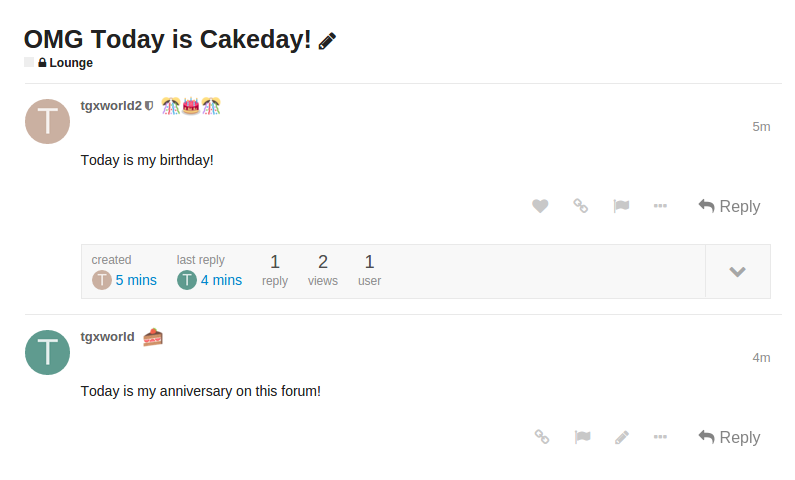

# Discourse K-pop Dates

Standalone K-pop birthdays, anniversaries, follows, and ritual plugin for Discourse.




# Installing

See https://meta.discourse.org/t/install-a-plugin/19157/14

# Offline K-pop entity import

This plugin includes a minimal bulk-import path for `DiscourseKpopDates::KpopEntity` records.
It is intended for normalized, offline-saved calendar data such as a kpopping export that was prepared outside the plugin runtime.

Live kpopping scraping is intentionally out of scope for the plugin runtime. Fetching and normalization should happen offline, then the saved JSON can be imported into Discourse.

## Supported JSON shape

```json
{
  "source": "kpopping-calendar",
  "generated_at": "2026-04-20T00:00:00Z",
  "entities": [
    {
      "display_name": "IU",
      "native_name": "아이유",
      "slug": "iu",
      "entity_kind": "solo",
      "active": true,
      "birthday": { "month": 5, "day": 16, "year": 1993 },
      "anniversary": { "month": 9, "day": 18, "year": 2008 }
    },
    {
      "display_name": "BTS",
      "native_name": "방탄소년단",
      "slug": "bts",
      "entity_kind": "group",
      "active": true,
      "birthday": null,
      "anniversary": { "month": 6, "day": 13, "year": 2013 }
    }
  ]
}
```

## Import rules

- `slug` is the upsert key.
- `display_name`, `slug`, and `entity_kind` are required.
- `entity_kind` must be `solo` or `group`.
- `native_name` may be `null`.
- `active` defaults to `true` when omitted or `null`.
- `birthday.year` and `anniversary.year` may be `null`.
- Birthday fields are only valid for `solo` entities.
- Group imports should leave birthday fields blank.
- Invalid rows are recorded and skipped without aborting the full import.
- Duplicate `slug` values inside the same file are recorded as row errors.
- Invalid top-level payloads such as unreadable files, malformed JSON, or missing `entities` raise a clear error.

## Rake task

Run the importer with an absolute file path:

```bash
bundle exec rake discourse_kpop_dates:import_kpop_entities FILE=/absolute/path/to/kpop_entities.json
```

The task prints a concise summary of created, updated, skipped, and errored rows.

## Offline kpopping calendar export helper

This repository also includes a companion offline script for turning kpopping calendar data into the JSON format above.

Script path:

```bash
plugins/discourse-kpop-dates/script/kpopping_calendar_to_kpop_dates.py
```

Example usage:

```bash
python3 plugins/discourse-kpop-dates/script/kpopping_calendar_to_kpop_dates.py \
  --start-year 2024 \
  --end-year 2026 \
  --months 1-12 \
  --output /tmp/kpop_entities.json
```

Then import it:

```bash
bundle exec rake discourse_kpop_dates:import_kpop_entities FILE=/tmp/kpop_entities.json
```

Notes:

- The script only extracts birthdays and anniversaries.
- Birthday rows are treated as `solo` entities.
- Anniversary rows are treated as `group` entities.
- `native_name` is left as `null` because the calendar endpoint does not reliably provide it.
- The script is meant for low-frequency offline use, not continuous live scraping inside Discourse.

# License

MIT
